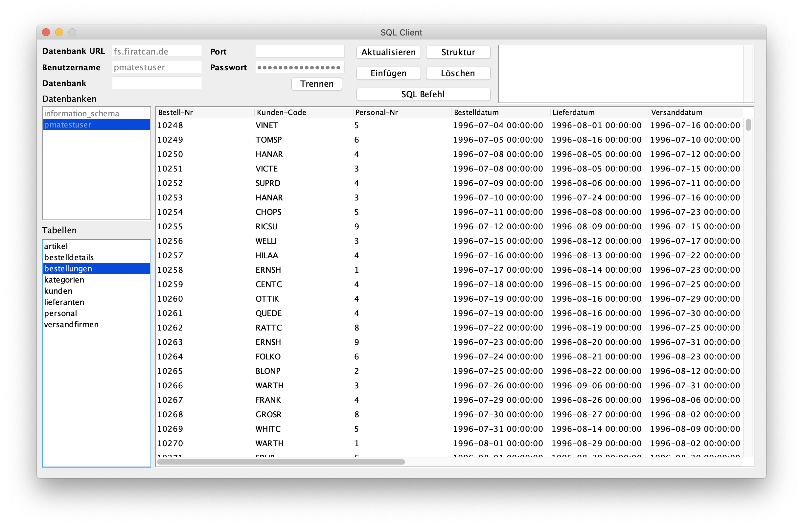

**Warning**
-
This Project is a copy from a school project and I wouldn't recommend to use it before making a few changes, especially code design changes. I don't work on this project anymore. 

# Das Projekt
*   Datenbankverwaltung in Java
*   Kompatibilität mit jeder MySQL Datenbank
*   Anzeigen der SQL Strukturen der Tabellen
*   Datensätze bearbeiten
*   Dynamisches Einfügen von neuen Datensätzen
*   Löschen von Datensätzen
*   Ausführung von benutzerdefinierten SQL Befehlen
*   Interaktive Fehlerausgabe
*   In Java-Editor erstellt

## Warum dieses Projekt
Ich habe eine Datenbankverwaltung als Projekt gewählt da es für mich einen Mehrwert bietet, ich habe vor das Programm in Zukunft selbst zu nutzen, um schnell und einfach meine Datenbanken zu verwalten und einzusehen.

## Inspiration
Ich habe mich von verschiedenen Verwaltungsprogrammen inspirieren lassen und habe die, für mich, nützlichsten Funktionen übernommen.

## Herangehensweise
Ich habe mich zuerst auf die Erstellung der JFrames beschäftigt und mir dabei die wichtigsten Funktionen einer Datenbankverwaltung überlegt.

Als die JFrames fertig waren habe ich die Funktionen zum Herstellen der Verbindung zur Datenbank erstellt.

Danach habe ich nacheinander die einzelnen Funktionen hinzugefügt.

## Genutzte Programme
Als Entwicklungsumgebung kam zu Anfang der Java-Editor zum Einsatz, für die Finale Kompilierung und Umwandelung in eine .jar Datei wurde Eclipse verwendet.

## Aufgetretene Fehler und Probleme
Während der Programmierung sind immer wieder kleinere Fehler aufgetreten, die ich mit einer schnellen Suche im Internet allerdings lösen konnte.

Ein Beispiel war zum Beispiel die Erstellung von ListSelectionActionListenern, dazu habe ich nach kurzer suche eine ausführliche Beschreibung im Internet gefunden.

Hartnäckige Probleme gab es mit dem Java-Editor als sich die Komplexität des Programmes erhöhte.

Ein großes Problem war zudem das Automatische Layout für das Programm, wodurch ein dynamisches vergrößern und verkleinern des Programms erreicht werden sollte.

Leider habe ich dazu keine Lösungen gefunden die gut umzusetzen waren. Da eine Manuelle Veränderung der Größen die Performance des Programms zu stark beeinträchtigt musste ich leider eine feste Größe für das Fenster einstellen.

Am Ende könnte sich die MySQL Bibliothek nicht korrekt in das Projekt einbinden weshalb ich Eclipse zum erstellen einer .jar Datei nutzen musste.

# Anleitung

## Verbindung herstellen
Um eine Verbindung herstellen zu können müssen Sie die Daten der MySQL-Datenbank in den Client einfügen.

Benötigt wird die Server Adresse und der Benutzername.

Alle restlichen Angaben sind optional.

Wenn kein Port angegeben ist wird der Standard 3306 genutzt.

Nachdem alle Daten eingetragen wurden müssen Sie auf den Verbinden-Button drücken.

## Dantenbank auswählen
Wenn Sie bei der Verbindungsherstellung keine Datenbank eingetragen haben können Sie aus der Liste der Datenbanken eine Datenbank auswählen.

Es werden alle Datenbanken angezeigt, auf die der Benutzer Zugriff hat.

## Tabelle auswählen
Die Tabelle können Sie in der Liste der Tabellen auswählen, der Tabelleninhalt wird dann als eine Tabelle angezeigt.

## Datensätze bearbeiten
Um einen Datensatz zu bearbeiten müssen Sie auf diesen einen Doppelklick ausführen.

Daraufhin öffnet sich ein neues Fenster indem die aktuellen Werte des Datensatzes eingetragen sind.

Nachdem Sie die Daten bearbeitet haben bestätigen Sie die Eingabe mit der Enter-Taste und klicken Sie anschließend auf den „OK“-Button.

Wenn keine Fehler aufgetreten sind sollte der Datensatz erfolgreich geändert worden sein.

Wenn Sie nun auf den „Aktualisieren“-Button klicken sollten sie die aktuellen Daten sehen.

## Datensatz löschen
Um einen Datensatz zu löschen wählen Sie diesen in der Tabelle aus und klicken Sie auf den „Löschen“-Button.

Nun sollte ein Fenster mit folgender Meldung erscheinen:

Nach einem Klick auf den „OK“-Button wird der Datensatz gelöscht.

Wenn Sie den Datensatz gelöscht haben müssen Sie auf den „Aktualisieren“-Button drücken, um die Veränderung zu sehen.

## Datensatz einfügen
Um einen neuen Datensatz in die Tabelle einzufügen, müssen sie auf den „Einfügen“-Button klicken.

Daraufhin öffnet sich ein neues Fenster, in dem sich die Struktur der aktuellen Tabelle öffnet.

Geben Sie die Daten in die leeren Felder ein und bestätigen Sie Ihre Eingaben mit der „Enter“-Taste.

Klicken Sie daraufhin auf den „OK“-Button.

Wenn keine Fehler auftreten wurde der Datensatz erfolgreich in die Tabelle eingefügt.

## SQL Befehl ausführen
Um einen SQL Befehl auszuführen müssen Sie auf den Button „SQL Befehl“ klicken.

Danach sollte ein Fenster mit einem Textfeld erscheinen.

In das Textfeld muss der SQL Befehl eingegeben werden, danach bestätigen Sie Ihre Eingabe mit einem Klick auf den „OK“-Button.

## Struktur einer Tabelle anzeigen
Bevor Sie die SQL Struktur angezeigt werden kann müssen Sie eine Tabelle auswählen.

Mit einem Klick auf den „Struktur“-Button öffnet sich dann ein Fenster, das die aktuelle SQL Struktur der ausgewählten Tabelle anzeigt.

*   COLUMN_NAME: Name der Spalte
*   COLUMN_TYPE: Datentyp der Spalte
*   IS_NULLABLE: Gibt an ob die Spalte optional ist
*   COLUMN_KEY: Gibt den Schlüssel der Spalte an
*   COLUMN_DEFAULT: Gibt den Standardwert der Spalte an
*   EXTRA: Zusätzliche Informationen

# Zusätzliche Funktionen
## Fehlerausgabe
Der SQL Client bietet eine moderne Fehlerausgabe, die alle Fehler, die während und vor der Verbindung entstehen aufzählt.

Alle Fehler sind bereits ausreichend beschrieben und sind leicht nachzuvollziehen.

Die Fehlerausgabe befindet sich rechts-oben im SQL Client und ist markierbar, dadurch lassen sich die Fehler einfach kopieren.
